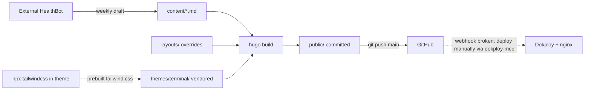

# Repository Guidelines

## Project Overview

`mrwilde.dev` — a personal tech blog built with **Hugo** (extended). It uses the
`terminal` theme (Tailwind CSS, dark slate palette, monospace), vendored directly
into this repo — a fork of the now-abandoned `techbarrack/terminal-hugo-theme`. The
site is served by **nginx** behind
**Dokploy** from **pre-built output that is committed to git** (`public/`); the
server runs no build step.

## Architecture & Data Flow

Hugo renders Markdown in `content/` through templates in `layouts/` (project
overrides) layered over `themes/terminal/` (vendored), emitting static HTML +
RSS into `public/`. CSS is **not** built by Hugo — Tailwind is compiled ahead of
time inside the theme and Hugo only minifies/fingerprints the result.



- **Template override order:** project `layouts/<path>` shadows
  `themes/terminal/layouts/<path>` file-by-file (project wins). Only 13 files are
  overridden; everything else resolves to the theme.
- **CSS pipeline (two stages):** (1) `npx tailwindcss` in `themes/terminal/`
  writes the committed `themes/terminal/assets/css/tailwind.css`; (2) Hugo's
  `head/css.html` does `resources.Match "css/*.css" | minify | fingerprint` →
  `/css/tailwind.min.<sha>.css` (SRI). `navbar.js` follows the same path.
- **Automation:** an *external* HealthBot agent (not in this repo) writes weekly
  health summaries into `content/health/` and triggers deploy via the
  `dokploy-mcp` MCP server.

## Key Directories

| Path | Purpose |
|------|---------|
| `content/` | Markdown source: `blog/`, `health/`, `tags/`, `authors/`, `_index.md`, `about.md` |
| `layouts/` | Project template overrides — shadow theme files per-path (Hugo precedence) |
| `themes/terminal/` | Vendored theme — editable directly; project `layouts/` still override per-path |
| `static/` | Verbatim-copied assets (only `favicon.ico`, `favicon.jpg`) → `public/` root |
| `public/` | **Committed build artifact** served by Dokploy; do not hand-edit |
| `archetypes/` | `hugo new` scaffold (`default.md`) |
| `old-blog/` | Legacy Retype-format originals, excluded from build (outside `content/`) |
| `.claude/` | `settings.local.json` only (Dokploy MCP permission); no in-repo skills |

## Development Commands

```bash
npm install                                          # PostCSS deps (see Tooling note)

hugo server --buildDrafts --disableFastRender -w     # dev server, live reload
hugo --cleanDestinationDir                           # production build → public/ (see Deployment)
hugo new blog/my-post-name.md                        # scaffold a new post

# Rebuild Tailwind ONLY when utility classes change (run inside the theme):
cd themes/terminal && npm install && npm run prod    # → assets/css/tailwind.css
```

`--buildDrafts` is for **local preview only** (all `content/health/*-weekly-update.md`
posts are `draft: true`); production builds **plain** (no `--buildDrafts`) so drafts stay
unpublished. No `hugo` build regenerates Tailwind (see the CSS pipeline above).

## Code Conventions & Common Patterns

- **Front matter is YAML (`---`)** everywhere in `content/`. (The archetype emits
  TOML `+++` — a known mismatch; hand-author YAML to match existing posts.)
- **Canonical blog post front matter** (`content/blog/what-is-wp-cli.md`):
  ```yaml
  ---
  title: "What is WP-CLI and what can it do for you?"
  date: 2018-03-08
  draft: false
  params:
    slug: "what-is-wp-cli"
  layout: "post"
  tags: ["wordpress", "cli", "Tools"]
  authors: ["Robert Wilde"]
  description: the back-door to your WordPress website
  ---
  ```
- **Permalink** is `/blog/:year/:month/:day/:title/` where `:title` is the
  slugified **title**. `params.slug` is effectively decorative (not the permalink
  driver). Tag casing across posts is inconsistent (`"Tools"` vs `"cli"`).
- **Post forms:** single file `content/blog/<topic>.md`, or a page bundle
  `content/blog/<name>/index.md` with **colocated images referenced by bare
  filename** (``, not `/static/...`). Folder name need not match
  `params.slug`.
- **Shortcodes:**
  - `youtube` (in `layouts/_shortcodes/`): ``.
  - `chart` (in `layouts/shortcodes/`, paired, health posts only):
    `<Chart.js JSON>`.
    Chart.js CDN is injected by `head.html` **only** for pages tagged `health` or
    in the `health` section — `chart` renders broken elsewhere.
- **Overriding the theme:** copy the theme's template into the matching
  `layouts/<path>` and edit there. SEO/social meta live in
  `layouts/partials/head/{meta-seo,meta-opengraph,meta-twitter,favicons}.html`.
- **Tailwind patterns:** utility-first; body `bg-gradient-to-r from-slate-900
  to-slate-800 font-mono text-white`, content in `prose prose-invert max-w-full`,
  accents `hover:text-sky-400`, responsive `max-sm:`/`lg:` variants.

## Important Files

- `hugo.toml` — site config (TOML): theme, permalinks, taxonomies (`tags`,
  `authors`), `outputs` HTML+RSS, `markup.goldmark.unsafe=true`, menus.
- `layouts/_default/{baseof,home,post}.html` — page skeletons; `post.html` adds a
  description block and reading time.
- `layouts/partials/head.html` — most significant override (meta partials +
  conditional Chart.js).
- `layouts/shortcodes/chart.html`, `layouts/_shortcodes/youtube.html`.
- `themes/terminal/assets/css/tailwind/tailwind.config.js` — Tailwind config;
  `themes/terminal/assets/css/tailwind.css` — committed prebuilt CSS Hugo consumes.
- `archetypes/default.md`, `README.md`, `CLAUDE.md`, `.claude/settings.local.json`.

## Runtime/Tooling Preferences

- **Hugo extended ≥ 0.116.0** is the only real build tool (drives rendering and
  asset minify/fingerprint). Required by `hugo.toml [module.hugoVersion]`.
- **Package manager: npm** (`package-lock.json` lockfileVersion 3) — **not Bun**.
  Node version is unpinned (no `.nvmrc`/`.node-version`).
- The Tailwind build lives in **`themes/terminal/package.json`** (`tailwindcss`,
  `@tailwindcss/typography`). The root `package.json` lists
  `autoprefixer`/`postcss`/`postcss-cli` but has **no scripts and no
  `postcss.config.js`** — these root deps are effectively orphaned.
- **DDEV is not configured** (`.idea/DdevIntegration.xml` is an IDE artifact; no
  `.ddev/` exists).

## Testing & QA

- **No tests, linters, or CI exist** (no `.github/workflows`, no test runner, no
  npm `test`/`lint` scripts, no Makefile).
- Verification = a clean local build: run `hugo` (and `hugo server` to preview)
  and confirm no build errors and correct rendered output. When changing
  templates or front matter, check the affected page renders as expected.
- **Tailwind purge caveat:** `tailwind.config.js` content globs scan only the
  theme's `layouts/`/`content/`. New utility classes added in **project** `layouts/`
  may be purged on a prod CSS rebuild unless safelisted in the theme config.

## Deployment

`public/` **must be committed**: Dokploy serves prebuilt files with no build step
(app `MrWilde.dev`, `applicationId wb7Ed-dnU3a9-683O8Qdu`, `buildType: static`,
branch `main`, `buildPath`/`watchPaths: /public`).

**Auto-deploy is currently BROKEN.** Despite Dokploy `autoDeploy: true`, the GitHub
webhook does not fire for normal pushes, so a plain `git push` does NOT update the
live site. The only deploys that land are the external HealthBot's, because it
triggers Dokploy explicitly via the `dokploy-mcp` MCP server. Until the webhook is
repaired, after pushing you MUST trigger a deploy yourself with the `dokploy-mcp`
`application-deploy` tool (`applicationId: wb7Ed-dnU3a9-683O8Qdu`), then verify the
live site itself (fresh `last-modified`, new URLs return 200), not just a `done` status.

```bash
# STOP any running `hugo server` first: it bakes localhost URLs + a livereload
# script into public/, which must never be committed.
hugo --cleanDestinationDir    # clean production build (plain, NO --buildDrafts)
git add content/ public/      # stage source AND built output
git commit -m "Add new post"
git push                      # push to main (does NOT auto-deploy right now)
# then: dokploy-mcp application-deploy (applicationId wb7Ed-dnU3a9-683O8Qdu), verify live
```

Production is a **plain** build (no `--buildDrafts`), so `content/health/*-weekly-update.md`
(`draft: true`) stays unpublished; do not publish drafts unless explicitly asked.
Always build with `--cleanDestinationDir`: Hugo does not purge `publishDir`, so
without it, deleted/renamed pages, orphaned `draft: true` health pages, and stale
fingerprinted assets linger in `public/` and get served (draft health URLs would
become directly reachable).
