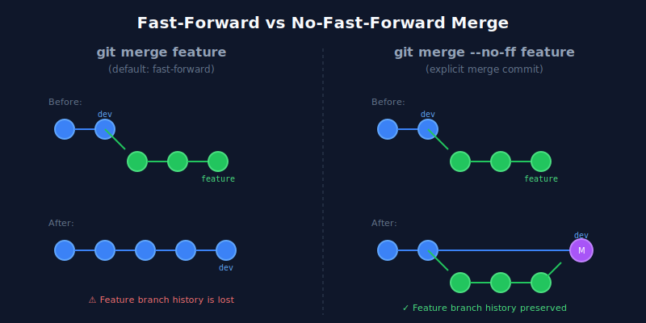
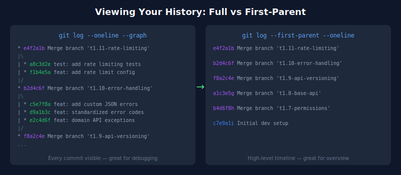

I recently started a new project and decided to try something different with my Git workflow. Instead of accepting
whatever history happens to emerge from my merges, I'm being intentional about *what history I want to keep and where*.

The result? A `dev` branch that tells the full story of how features were built, and a `main` branch that reads like a
clean changelog. Here's what I've learned so far.

## The Problem with Default Merges

If you've worked on any codebase for a while, you've probably experienced the frustration of trying to understand *why*
something was done a certain way. You run `git log`, and you're faced with either a confusing tangle of commits from
multiple features interleaved together, or a completely linear history where the context of grouped work has been lost.

Git's default merge behaviour (fast-forward when possible) prioritises a "clean" linear history. But cleaning isn't always
useful. When something breaks in production at 2am, and you need to understand what changed, you want context. You want
to see that these five commits were all part of implementing rate limiting, not scattered randomly among database
migrations and CSS fixes.

## The Strategy: Different Histories for Different Purposes

Here's the approach I'm experimenting with:

**Feature → Dev: Use `--no-ff` (no fast-forward)**
Every feature branch merge creates an explicit merge commit, preserving the "bubble" of commits that made up that
feature.

**Dev → Main: Use squash merge**
When a phase or milestone is complete, squash everything into a single commit on `main`. One commit per release, clean
and simple.

The key insight is that these two branches serve different audiences. The `dev` branch is for developers who need to
debug, understand context, and trace the evolution of features. The `main` branch is for releases, deployments, and
anyone who just needs to know "what shipped."



## What --no-ff Actually Does

When you merge a feature branch with `git merge --no-ff feature-branch`, Git creates a merge commit even if it could
technically just move the branch pointer forward. This merge commit has two parents: the previous `dev` commit and the
last commit of your feature branch.

The visual result in your Git history is that distinctive "bubble" or "railroad track" pattern. Each feature branch
remains visible as a separate track that diverges from and rejoins the main line.

Here's what this looks like in practice with my current project:

```
*   Merge branch 't1.11-rate-limiting' into dev
|\
| * test: add tests for API rate limiting
| * feat: add configuration for API rate limiting
| * feat: add rate limiting middleware to API routes
|/
*   Merge branch 't1.10-error-handling' into dev
|\
| * feat: add custom JSON error handling for API exceptions
| * feat: enhance error response methods
| * feat: introduce domain-specific API exceptions
| * feat: introduce standardized error code enumeration
|/
*   Merge branch 't1.9-api-versioning' into dev
```

Each feature is clearly bounded. I can see exactly which commits belong to rate limiting, which belong to error
handling, and so on.

## The Power of --first-parent

Here's where it gets really useful. When I want a high-level view of what's been integrated (without all the individual
commits), I can run:

```bash
git log --first-parent --oneline
```

This shows only the merge commits, effectively giving me a timeline of features:

```
e4f2a1b Merge branch 't1.11-rate-limiting' into dev
b2d4c6f Merge branch 't1.10-error-handling' into dev
f8a2c4e Merge branch 't1.9-api-versioning' into dev
a1c3e5g Merge branch 't1.8-base-api' into dev
```

It's like having two views of the same history: zoom out for the overview, zoom in for the details.



## Squashing to Main: Clean Releases

At the end of each project phase (in my case, tied to milestone deliverables), I merge `dev` into `main` with a squash:

```bash
git checkout main
git merge --squash dev
git commit -m "Phase 1: Foundation & Core Infrastructure"
```

This collapses all the detailed history into a single commit on `main`. The result is that `main` has one commit per
phase/release, making it trivially easy to see what shipped when, and to roll back an entire release if needed.


The developers still have access to all the detailed history on `dev`. Nothing is lost. It's just organised.

## Easy Feature Reverts

One benefit I hadn't fully appreciated until I started using this approach: reverting a feature is straightforward.
Because each feature merge is a single commit (with two parents), you can revert the entire feature with:

```bash
git revert -m 1 <merge-commit-sha>
```

Compare this to trying to revert a fast-forward merge, where you'd need to identify and revert each commit
that was part of the feature. At 2am, that's not a game I want to play.

## The Trade-offs

I want to be honest about the downsides because this approach isn't free:

**More commits overall.** Every merge adds a commit. If you have dozens of features, that's dozens of additional merge
commits on `dev`. In practice, I haven't found this to be a problem, but it's worth noting.

**Visual complexity.** The "railroad track" graph can look intimidating at first. Tools like GitKraken or the Git graph
in your IDE help, but it's definitely more complex than a straight line.

**Team discipline is required.** This only works if everyone on the team uses `--no-ff` consistently. One person doing
fast-forward merges breaks the pattern. You can enforce this with Git config or CI checks.

**Overhead for tiny changes.** For a single-commit typo fix, a merge commit feels like overkill. I'm still working out
where to draw the line on this.

## Making It Stick

To make `--no-ff` the default for merges into `dev`, you can set up your Git config:

```bash
# Make --no-ff the default for all merges
git config merge.ff false

# But keep fast-forward for pulls (to avoid noise)
git config pull.ff only
```

Or if you're using a GUI like GitKraken, there's usually a setting to control merge behaviour.

## Early Verdict

I'm only a few weeks into using this approach, but I'm genuinely impressed with how readable the history has become.
When I look at my Git graph, I can immediately see "oh, that's when I added rate limiting" without scanning through
individual commits.

The squash-to-main strategy means I'll have a clean record of what shipped in each phase, which is particularly useful
for client work where I'm invoicing per milestone.

Is this the One True Git Workflow? Probably not. But for a project with clear phases and a need for both detailed
developer history and clean releases, it's working well so far.

I'll report back once I've lived with it longer.

---

*Got a different approach to Git history? I'd love to hear about it. Find me on [LinkedIn](https://www.linkedin.com/in/robertewilde/) or leave a
comment below.*
