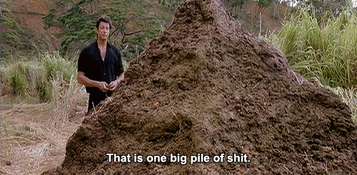

## A fundamental truth all developers must acknowledge – "your code is 💩.."

This may sound harsh, but consider this: have you ever worked on a project that functions flawlessly, with no bugs, no
client complaints, and every feature seamlessly integrating as if crafted by a precision machine? If you have, then I
have some oceanfront property to sell you.

The reality is that perfection in coding does not exist. While we can strive for it and work diligently to improve our
systems, any complex project with numerous moving parts that undergoes constant changes will never achieve absolute
perfection. The key is to accept this truth and, as the immortal words of Dory suggest, "Just keep swimming."

If you encounter project owners or lead developers who insist, "It was working just fine yesterday," or "That code works
in another environment, so it should work here," it's time to reconsider your position. You can try to guide them with
diagrams, reports, and detailed explanations of the issues, but often they will cling to the belief that their code is
flawless. You can lead a horse to water but no matter what happens, they won't believe it's water and die of thirst
before admitting it.

Just be happy your code is 💩 but not all 💩 stinks. Like the book says "Every body 💩" and it's OK.